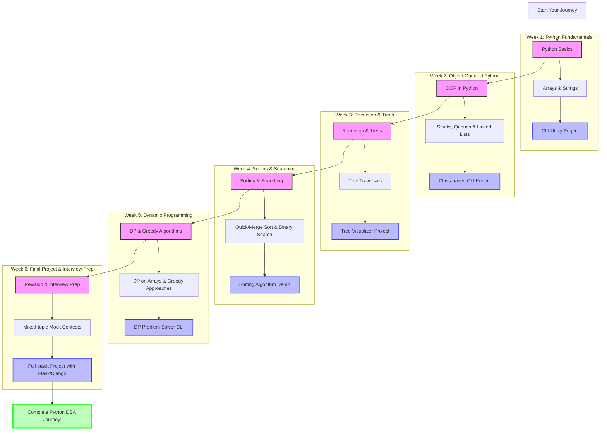
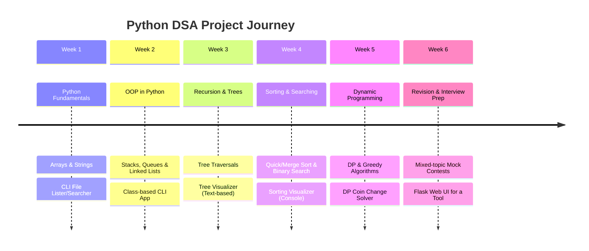

# Python with DSA - Visual Learning Journey

## Daily Schedule

```mermaid
gantt
    title Daily Learning Schedule (12 Hours)
    dateFormat  HH:mm
    axisFormat %H:%M
    
    section Morning
    Udemy Lectures & Notes           :09:00, 3h
    Break                            :12:00, 30m
    
    section Afternoon
    Course Exercises                 :12:30, 3h
    Break                            :15:30, 30m
    LeetCode/HackerRank Practice     :16:00, 2h
    Break                            :18:00, 30m
    
    section Evening
    Mini-Project / Deep Dive         :18:30, 2h
    Reflect & Plan                   :20:30, 30m
```

## 6-Week Learning Roadmap

## Weekly Projects Timeline

## Project Details

| Week | Project | Description | Skills Applied |
|:----:|---------|-------------|----------------|
|  | **CLI File Utility** | A Python script that lists files or searches by name in the terminal |   |
|  | **Class-based CLI App** | Enhanced file utility using OOP principles |   |
|  | **Tree Visualizer** | Terminal-based binary tree visualization tool |   |
|  | **Sorting Visualizer** | Console-based step-by-step sorting demonstration |   |
|  | **DP Problem Solver** | CLI tool that solves dynamic programming problems |   |
|  | **Flask Web UI** | Web interface for your Python tools with deployment |   |

## Success Checklist

- [ ] **Week 1**: Python fundamentals mastered, CLI utility completed
- [ ] **Week 2**: OOP concepts understood, class-based design implemented
- [ ] **Week 3**: Recursion & tree traversals mastered, visualizer working
- [ ] **Week 4**: Sorting algorithms implemented and visualized
- [ ] **Week 5**: Dynamic programming problems solved efficiently
- [ ] **Week 6**: Full-stack project deployed, interview questions practiced

## Key Reminders

1. **Track Progress**: Check off completed items at the end of each week
2. **Reflect Daily**: Use your 30-minute wrap-up to identify gaps and plan the next day
3. **Build As You Learn**: Each mini-project reinforces the week's learning objectives
4. **Stay Consistent**: Six weeks of focused work + regular reviews = real momentum
